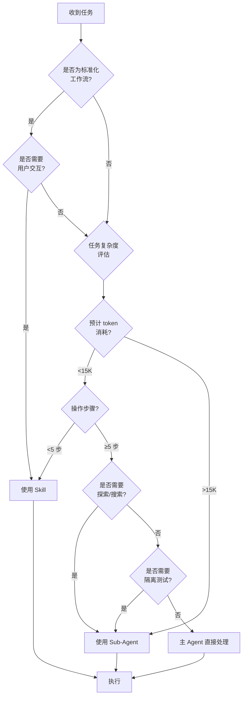

# Sub-Agent Governance Framework
**Version**: 1.0.0
**Created**: 2025-11-06
**Purpose**: 定义何时使用 Sub-Agent vs Skills，避免主 Agent 上下文污染

---

## I. 核心概念

### 1.1 上下文污染 (Context Pollution)

**定义**: 主 Agent 的对话历史累积过多无关信息，导致：
- Token 使用率 >60% (120K/200K)
- 响应质量下降（遗忘早期指令）
- 成本增加（每次调用传输完整历史）
- 决策延迟（需处理冗余信息）

**触发阈值**:
- 单次任务预计消耗 >15K tokens
- 需读取 >20 个文件
- 搜索结果 >500 条匹配
- 递归探索深度 >3 层

### 1.2 执行模型对比

| 维度 | Skills | Sub-Agents |
|------|--------|-----------|
| **执行位置** | 主 Agent 内 | 独立进程 |
| **上下文** | 共享历史 | 隔离 context |
| **Token 成本** | 累积到主对话 | 独立计费 |
| **交互性** | 支持用户提问 | 仅返回最终结果 |
| **适用任务** | 轻量工作流 | 大型/独立任务 |
| **生命周期** | 随主对话存在 | 任务完成即销毁 |

---

## II. 决策流程图



---

## III. 使用规则

### 3.1 ✅ 必须使用 Sub-Agent

| 场景 | 原因 | 推荐 Agent |
|------|------|-----------|
| 代码库探索（关键词模糊） | 需多轮 grep/glob，token 消耗大 | `Explore` |
| 实现复杂功能 | 多文件修改，需自主规划 | `Plan` |
| 依赖审计与升级 | 需读取 package.json、搜索 breaking changes | `general-purpose` |
| 大规模重构 | 修改 >10 个文件，需回滚能力 | `general-purpose` |
| 测试覆盖分析 | 扫描所有测试文件，统计覆盖率 | `Explore` |

### 3.2 ✅ 必须使用 Skills

| 场景 | 原因 | 适用 Skill |
|------|------|-----------|
| Prompt 优化 | 轻量转换，需用户确认 | `ann_ai` |
| 创建新 Skill | 标准化流程，多轮交互 | `skills_mother` |
| 文档格式转换 | 单文件操作，<5 步 | 自定义 |
| API 调用封装 | 确定性操作，脚本化 | 自定义 |
| 数据验证/清洗 | 轻量逻辑，快速反馈 | 自定义 |

### 3.3 ⚖️ 灵活判断（主 Agent 决策）

| 场景 | 判断依据 |
|------|---------|
| 读取 2-5 个已知文件 | 直接处理（使用 Read tool） |
| 简单 bug 修复 | 如已知问题位置，直接 Edit |
| 配置文件修改 | 单文件改动，直接处理 |
| 回答技术问题 | 无需代码操作，直接响应 |

---

## IV. Sub-Agent 使用规范

### 4.1 启动协议

**标准调用格式**:
```typescript
Task({
  subagent_type: "Explore" | "Plan" | "general-purpose",
  description: "5-10 字任务描述",  // 简短标题
  prompt: `
详细任务说明（包含）：
1. **目标**: 明确期望输出
2. **范围**: 限定搜索/修改范围
3. **约束**: 禁止操作（如禁止删除）
4. **返回格式**: 指定输出结构

示例：找到所有处理 REST 日计薪的函数，返回：
- 文件路径 + 行号
- 函数签名
- 当前实现逻辑概要
  `,
  model: "haiku" | "sonnet" | "opus"  // 默认继承
})
```

### 4.2 Model 选择策略

| 模型 | Token 成本 | 适用场景 |
|------|-----------|---------|
| `haiku` | 💰 | 简单搜索、文件列表、格式转换 |
| `sonnet` (默认) | 💰💰 | 代码分析、功能实现、复杂规划 |
| `opus` | 💰💰💰 | 架构设计、关键安全审计（慎用）|

**成本优化原则**:
- 探索任务优先 `haiku`（thoroughness: "quick"）
- 实现任务使用 `sonnet`
- 避免 `opus`，除非明确需要最高质量

### 4.3 并发策略

**支持并行**（单消息多 Task calls）:
```typescript
// ✅ 正确：独立任务并发
[
  Task({ subagent_type: "Explore", prompt: "搜索所有 API 路由" }),
  Task({ subagent_type: "Explore", prompt: "搜索所有测试文件" })
]
```

**禁止并行**（有依赖关系）:
```typescript
// ❌ 错误：结果依赖前序
Task({ prompt: "分析函数 A" })  // 需要先知道 A 在哪
Task({ prompt: "修改函数 A" })   // 依赖上一步结果
```

### 4.4 结果处理

**Sub-Agent 输出**:
- 最终报告（一次性消息）
- 不可追问（无状态）
- 需主 Agent 总结给用户

**主 Agent 职责**:
1. 验证 Sub-Agent 报告完整性
2. 提取关键信息
3. 用简洁中文总结给用户
4. 决定后续行动（继续任务/请求澄清）

---

## V. Skills 开发规范

### 5.1 何时创建新 Skill

**必要条件** (满足任意 2 项):
- [ ] 工作流重复出现 ≥3 次
- [ ] 流程固定（步骤/顺序可标准化）
- [ ] 需要领域知识（API 规范/格式标准）
- [ ] 包含确定性操作（脚本/模板）

**不应创建 Skill**:
- 一次性任务（如"修复某个 bug"）
- 高度依赖项目特定代码
- 步骤数 <3 且无复杂逻辑

### 5.2 Skill 结构要求

**必需文件**:
- `SKILL.md`: YAML header + 执行流程
- `README.md`: 使用说明

**可选文件**（按需）:
- `REFERENCE_*.md`: 大量参考资料（API 文档/规范）
- `EXAMPLES.md`: 复杂使用案例（≥3 个）
- `scripts/*.py`: 确定性脚本（数据处理/API 调用）

**命名规范**:
- Skill 目录: `小写_下划线` (如 `ann_ai`)
- 文档: `大写.md` (如 `SKILL.md`, `REFERENCE_API.md`)
- 脚本: `小写_下划线.py` (如 `parse_schedule.py`)

### 5.3 与 Sub-Agent 的协同

**Skill 可以调用 Sub-Agent**:
```markdown
[执行流程]

阶段 1：需求收集（Skill 内执行）
  - 用户交互，收集参数

阶段 2：代码分析（调用 Sub-Agent）
  - 使用 Task tool 启动 Explore agent
  - 搜索相关代码模式

阶段 3：文件生成（Skill 内执行）
  - 根据 Sub-Agent 结果生成代码
```

---

## VI. 上下文管理策略

### 6.1 监控指标

**主 Agent 应定期检查**:
- 当前 token 使用率（`<token_usage>` 标签）
- 对话轮次（>20 轮考虑总结）
- 任务复杂度（切换到 Sub-Agent）

**预警阈值**:
- ⚠️ Token 使用 >100K: 优先使用 Sub-Agent
- 🚨 Token 使用 >150K: 必须总结或清理上下文

### 6.2 上下文清理

**用户命令**:
```bash
/clear  # 清空对话历史，保留项目状态
```

**主 Agent 主动建议**（当检测到）:
```
🔔 提示：当前对话已消耗 120K tokens (60%)
建议操作：
1. 完成当前任务后使用 /clear
2. 将剩余任务拆分为独立 Sub-Agent 执行
```

### 6.3 任务切分原则

**垂直切分**（按功能模块）:
```
❌ 一次性任务："实现工资计算功能"
✅ 切分任务：
  - Task 1 (Sub-Agent): 探索现有计算逻辑
  - Task 2 (主 Agent): 设计新接口
  - Task 3 (Sub-Agent): 实现并测试
```

**水平切分**（按执行阶段）:
```
Phase 1: 探索阶段（Sub-Agent Explore）
Phase 2: 规划阶段（主 Agent + 用户讨论）
Phase 3: 实现阶段（Sub-Agent general-purpose）
```

---

## VII. 错误处理与回滚

### 7.1 Sub-Agent 失败处理

**失败类型**:
- `not_found`: 未找到目标（扩大搜索范围）
- `timeout`: 超时（简化任务范围）
- `incomplete`: 结果不完整（重新 prompt）

**重试策略**:
```typescript
// 第一次尝试
Task({ subagent_type: "Explore", thoroughness: "quick" })

// 如果失败，增加详细度
Task({ subagent_type: "Explore", thoroughness: "medium" })

// 最后尝试
Task({ subagent_type: "Explore", thoroughness: "very thorough" })
```

### 7.2 回滚机制

**Git 集成**（推荐）:
```bash
# Sub-Agent 开始前
git checkout -b temp/sub-agent-task-123

# Sub-Agent 执行修改

# 验证成功 → 合并
git checkout main && git merge temp/sub-agent-task-123

# 验证失败 → 回滚
git checkout main && git branch -D temp/sub-agent-task-123
```

---

## VIII. 最佳实践

### 8.1 Do's ✅

- **任务描述具体化**: "找到计算 REST 日薪的函数" > "搜索薪资相关代码"
- **限定范围**: "仅搜索 src/services/" > "搜索整个项目"
- **指定输出格式**: 要求返回 Markdown 表格/列表
- **使用 haiku 探索**: 初步探索用 haiku 降低成本
- **并行独立任务**: 同时启动多个无依赖的 Sub-Agent

### 8.2 Don'ts ❌

- **避免链式依赖**: Sub-Agent A 结果 → B 输入 → C 处理（用主 Agent 协调）
- **禁止过度使用 opus**: 成本是 sonnet 的 5 倍
- **不要传递大量代码**: Sub-Agent 会自己读取文件
- **避免重复启动**: 同一搜索不要重试 >3 次
- **不在 Skill 中处理大型任务**: 超过阈值立即切换 Sub-Agent

### 8.3 成本优化 Checklist

- [ ] 探索任务使用 `haiku` model
- [ ] 限定 `thoroughness: "quick"` 用于快速扫描
- [ ] 使用 `Glob` 工具（快）而非 `Bash find`（慢）
- [ ] 使用 `Grep` 工具而非 `Task(Explore)` 处理简单搜索
- [ ] 并行执行独立任务（减少总耗时）

---

## IX. 版本管理

### 9.1 变更日志

| 版本 | 日期 | 变更 |
|------|------|------|
| 1.0.0 | 2025-11-06 | 初始版本：定义 Sub-Agent vs Skills 决策框架 |

### 9.2 修订流程

**提议修改**:
1. 在实践中发现问题/改进点
2. 在 GitHub Issue 中提出
3. 讨论并达成共识

**审批要求**:
- 向下兼容优先
- 需更新相关文档（IMPLEMENTATION.md, AGENTS.md）
- 需提供迁移指南（如有破坏性变更）

---

## X. 参考资料

- **主 Agent 系统 Prompt**: Claude Code 内置指令（自动加载）
- **Skills 开发指南**: `.claude/skills/skills_mother/REFERENCE_WORKFLOW.md`
- **Task Tool 文档**: Claude Code 官方文档（WebFetch from docs.claude.com）
- **项目 Constitution**: `.specify/memory/constitution.md`

---

**维护者**: Claude Code User
**审阅周期**: 每月或每 10 次 Sub-Agent 调用后
