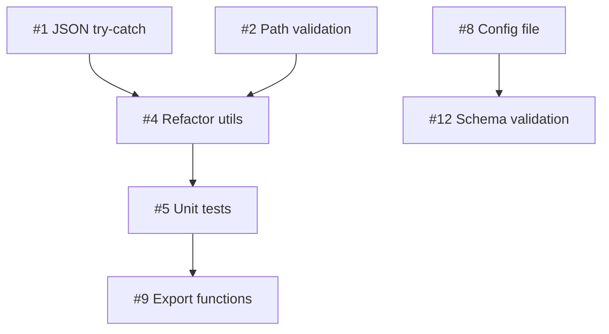

# Action Items - scripts/validation Review

**Generated**: 2025-11-28 17:47
**Total Issues**: 12
**Estimated Fix Time**: 1-2 days

---

## 🔴 P0 - CRITICAL (立即修复)

### 1. JSON.parse 异常处理缺失
**Risk**: DoS - 进程崩溃
**Files**: ocr-report.mjs:15, salary-verification.mjs:15
**Time**: 30min

**Action**:
```javascript
let payload
try {
  const raw = fs.readFileSync(filePath, 'utf8')
  payload = JSON.parse(raw)
} catch (err) {
  console.error(`[${scriptName}] Invalid JSON: ${err.message}`)
  process.exit(1)
}
```

**Owner**: Backend team
**Deadline**: 立即

---

### 2. 路径遍历攻击风险
**Risk**: Information Disclosure - 读取任意文件
**Files**: ocr-report.mjs:6-7, salary-verification.mjs:6-7
**Time**: 1h

**Action**:
```javascript
import { basename, resolve, relative } from 'node:path'

const allowedDir = resolve(process.cwd(), 'reports/validation')
const filePath = resolve(process.cwd(), input)
const rel = relative(allowedDir, filePath)

if (rel.startsWith('..') || path.isAbsolute(rel)) {
  console.error(`[${scriptName}] Invalid path: must be within reports/validation/`)
  process.exit(1)
}
```

**Owner**: Security team
**Deadline**: 今天

---

## 🟠 P1 - HIGH (本周修复)

### 3. 文件大小无限制 → DoS 风险
**Risk**: Memory exhaustion
**Files**: Both
**Time**: 30min

**Action**:
```javascript
import { statSync } from 'node:fs'

const MAX_SIZE = 10 * 1024 * 1024  // 10MB
const stats = statSync(filePath)
if (stats.size > MAX_SIZE) {
  console.error(`[${scriptName}] File too large: ${(stats.size / 1024 / 1024).toFixed(1)}MB (max 10MB)`)
  process.exit(1)
}
```

**Owner**: Backend team
**Deadline**: 本周三

---

### 4. 代码重复严重（DRY 违反）
**Risk**: 维护成本高，易引入 bug
**Files**: Both scripts
**Time**: 2-3h

**Action**:
1. 创建 `scripts/validation/utils/file-loader.mjs`
2. 抽取共享逻辑：
   - 参数解析
   - 文件验证
   - JSON 读取/解析
   - Schema 验证
3. 重构两个脚本使用 utils

**Owner**: Backend team
**Deadline**: 本周五

---

### 5. 缺乏单元测试（0% 覆盖）
**Risk**: 回归风险高，难以重构
**Files**: All
**Time**: 4-5h

**Action**:
1. 添加 `scripts/validation/*.test.mjs`
2. 测试覆盖：
   - normalizeAccuracy 边界情况
   - 错误处理路径
   - 安全测试（path traversal, large files）
3. 目标：80% 覆盖率

**Owner**: QA team
**Deadline**: 下周一

---

### 6. 错误消息泄露路径信息
**Risk**: Information Disclosure
**Files**: Both
**Time**: 15min

**Action**:
```javascript
import { basename } from 'node:path'
console.error(`[${scriptName}] Input file not found: ${basename(filePath)}`)
// 而非完整路径
```

**Owner**: Security team
**Deadline**: 本周三

---

## 🟡 P2 - MEDIUM (技术债务)

### 7. 缺少 TypeScript 类型
**Time**: 1-2h

**Action**:
- 添加 JSDoc 类型注释
- 或重命名为 .mts 并添加类型定义

**Owner**: Backend team
**Deadline**: 2 周内

---

### 8. 硬编码配置值
**Files**: ocr-report.mjs:46 (0.9), salary-verification.mjs:26 (10)
**Time**: 30min

**Action**:
```javascript
// config/validation.mjs
export default {
  ocr: { passThreshold: 0.9 },
  salary: { defaultTolerance: 10 }
}
```

**Owner**: Backend team
**Deadline**: 2 周内

---

### 9. 函数不可测试（无导出）
**Time**: 1h

**Action**:
```javascript
// 导出所有函数
export function normalizeAccuracy(entry) { /* ... */ }

// CLI entry point
if (import.meta.url === `file://${process.argv[1]}`) {
  main()
}
```

**Owner**: Backend team
**Deadline**: 2 周内

---

### 10. normalizeAccuracy 逻辑复杂
**File**: ocr-report.mjs:23-33
**Time**: 20min

**Action**: 添加 JSDoc 注释说明字段优先级
```javascript
/**
 * Normalize accuracy from multiple field formats
 * Priority: accuracy > correctCells/totalCells > correctTokens/totalTokens > matches/expected
 */
```

**Owner**: Backend team
**Deadline**: 3 周内

---

### 11. worst 计算边界情况
**File**: salary-verification.mjs:43
**Time**: 10min

**Action**:
```javascript
const worst = summary.length > 0
  ? summary.reduce((max, row) => row.absDelta > max.absDelta ? row : max)
  : { absDelta: 0 }
```

**Owner**: Backend team
**Deadline**: 3 周内

---

### 12. 缺少输入 Schema 验证
**Time**: 2-3h

**Action**:
```bash
npm install zod
```

```javascript
import { z } from 'zod'

const ocrCaseSchema = z.object({
  id: z.string().optional(),
  accuracy: z.number().min(0).max(1).optional(),
  correctCells: z.number().int().nonnegative().optional(),
  totalCells: z.number().int().positive().optional()
})

const result = z.array(ocrCaseSchema).safeParse(cases)
if (!result.success) {
  console.error(`[${scriptName}] Invalid input: ${result.error.message}`)
  process.exit(1)
}
```

**Owner**: Backend team
**Deadline**: 3 周内

---

## Timeline

### Week 1
- ✅ Day 1: P0 #1, #2 (安全修复)
- ✅ Day 2-3: P1 #3, #6 (安全加固)
- ✅ Day 4-5: P1 #4 (重构 utils)

### Week 2
- ✅ Day 1-2: P1 #5 (单元测试)
- ✅ Day 3-5: P2 #7, #8, #9 (代码质量)

### Week 3
- ✅ Day 1-2: P2 #10, #11, #12 (细节优化)
- ✅ Day 3-5: 文档和 code review

---

## Checklist

### Phase 1: Security (P0 + P1 安全)
- [ ] #1 JSON.parse try-catch
- [ ] #2 路径验证
- [ ] #3 文件大小限制
- [ ] #6 消毒错误消息
- [ ] 运行安全测试
- [ ] Code review (Security team)

### Phase 2: Refactor (P1 架构)
- [ ] #4 抽取 utils/file-loader.mjs
- [ ] 更新两个脚本使用 utils
- [ ] #5 添加单元测试
- [ ] 80% 测试覆盖率
- [ ] Code review (Backend team)

### Phase 3: Quality (P2)
- [ ] #7 添加类型注释
- [ ] #8 配置文件
- [ ] #9 导出函数
- [ ] #10 添加注释
- [ ] #11 修复边界情况
- [ ] #12 Schema 验证
- [ ] 更新文档

---

## Dependencies



---

## Risk Assessment

| Priority | If Not Fixed | Impact |
|----------|--------------|--------|
| P0 | High - Security breach, DoS | Production incident |
| P1 | Medium - Technical debt grows | Hard to maintain |
| P2 | Low - Code quality declines | Developer friction |

---

## Success Metrics

### Week 1 (P0)
- ✅ 0 critical security vulnerabilities
- ✅ All P0 tests pass

### Week 2 (P1)
- ✅ <5% code duplication
- ✅ 80% test coverage

### Week 3 (P2)
- ✅ 100% functions documented
- ✅ All linting rules pass

---

## Contact

**Questions?**
- Security issues: @security-team
- Architecture: @system-architect
- Implementation: @backend-team

**Review Report**: [outputs/review-20251128-174726/](outputs/review-20251128-174726/)
